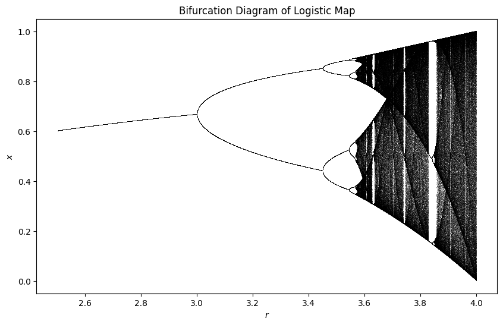
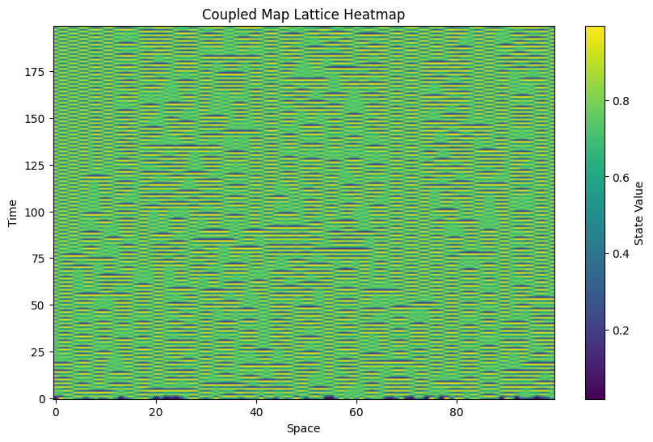
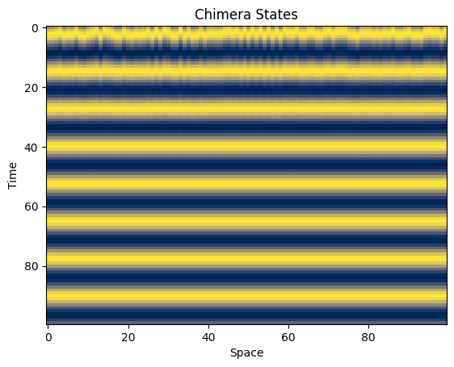

# Coupled Map Lattice Chaos

Simulation of spatiotemporal chaos in coupled nonlinear dynamical systems using numerical methods in Python.

## Overview

This repository contains numerical simulations of coupled nonlinear systems used to study spatiotemporal chaos and collective dynamics. The project explores how local nonlinear dynamics combined with spatial coupling can produce complex behaviors such as synchronization, pattern formation, and chimera states.

The models implemented here are classical systems in nonlinear dynamics and complex systems research.

## Models Implemented

### 1. Logistic Map and Bifurcation Analysis

The logistic map is a simple nonlinear discrete-time dynamical system given by:

$$x_{n+1} = r x_n (1 − x_n)$$

By varying the parameter r, the system exhibits a transition from fixed points to periodic oscillations and eventually chaotic dynamics. A bifurcation diagram is generated to visualize this transition.

### 2. Coupled Map Lattices (CML)

Coupled map lattices extend the logistic map to spatially distributed systems. Each site in a lattice evolves according to a nonlinear map and interacts with neighboring sites through coupling.

The general update rule is:

$$x_i(t+1) = (1 − ε) f(x_i(t)) + (ε / 2) [ f(x_{i−1}(t)) + f(x_{i+1}(t)) ]$$

where

ε : coupling strength
f : local nonlinear map

These systems are widely used to study spatiotemporal chaos and pattern formation.

### 3. Rössler Oscillator Lattice

Each lattice site contains a chaotic oscillator governed by the Rössler system:

$$dx/dt = −y − z$$
$$dy/dt = x + a y$$
$$dz/dt = b + z(x − c)$$

These oscillators are coupled through nearest-neighbor interactions in a three-dimensional lattice. The system demonstrates how chaotic dynamics propagate through spatially extended systems.

### 4. Chimera States

Chimera states occur when identical oscillators split into synchronized and desynchronized groups despite having identical dynamics and coupling.

The model implemented here is a phase oscillator system with sinusoidal coupling similar to the Kuramoto model. The resulting dynamics show coexistence of coherent and incoherent regions in the lattice.

## Visualization

The simulations include several visualization techniques to analyze the system dynamics:

* Bifurcation diagrams for nonlinear maps
* Spatiotemporal heatmaps of lattice evolution
* Phase dynamics visualization for chimera states

These visualizations help illustrate transitions to chaos and collective behavior in coupled systems.

## Requirements

Python 3
Jupyter Notebook
Numpy 
Matplotlib.pyplot
scipy

Install required packages using:

pip install numpy scipy matplotlib

## How to Run

Open the notebook in Jupyter and run the cells to reproduce the simulations.

## Applications

Coupled nonlinear dynamical systems appear in many scientific fields including:

• nonlinear physics  
• complex systems  
• biological oscillations  
• pattern formation

## Author

Kumar Onker
MSc Physics

Research interests:
Nonlinear Dynamics
Complex Systems
Computational Modeling
